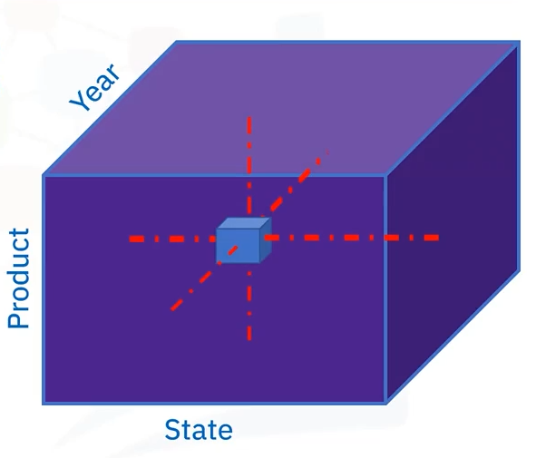
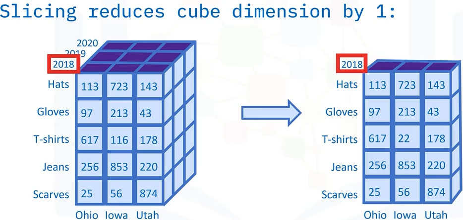
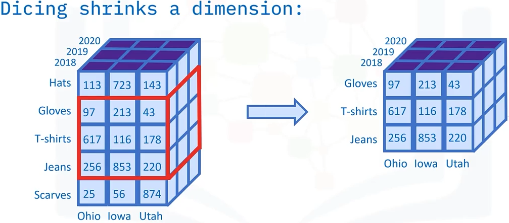
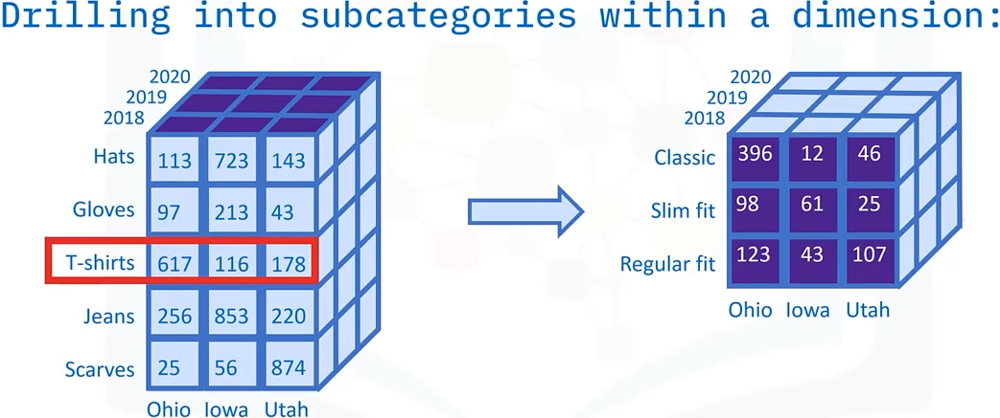
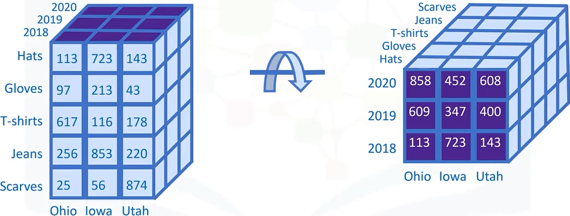
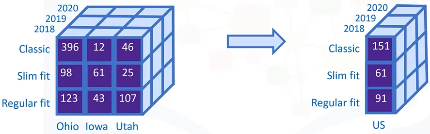

# Cubes, Rollups, Materialized Views and Tables

Goals of this section:

- Relate what a data cube is in terms of a star schema.
- Discuss the terms slice, dice, drill up or down, roll up, and pivot in terms of data cubes.
- Describe what a materialized view is.
- Recall two use cases for materialized views.

## What is a data cube?

Let's use an example to illustrate the concept of a data cube. 



Here is a cube generated from an imaginary star schema for a Sales OLAP (Online Analytical Processing System). The coordinates of the cube are defined by a set of dimensions, which are selected from the star schema. This illustration shows three dimensions , but data cubes **can have many dimensions**.

We have the product categories corresponding to the item sold, the state the items were sold from, and the year these products were sold in. These dimensions corresponds to the coordinates in a data cube.

The cells of the cube are defined by a fact of interest from the schema, which could be something like "Total sales in thousand of dolars". Imagine the cell with the value of "243", this would indicate "243 thousand dollars" for some Product, State, and Year combination.

There are many operations you can perform on data cubes, such as slicing, dicing, drilling up and down, pivoting, and rolling up. Let's go over some examples of these operations, starting with slicing.

### Slicing data cubes

Slicing a data cube involves selecting a single member from a dimension, which yields a data cube that has onde dimension less than the original.

For example, you can slice this sales cube by selecting only the year 2018 from the year dimension, allowing you to analyze sales totals for all sales states and all products for the year 2018.



### Dicing data cubes

Similarly, dicing a cube involves selecting a subset of values from a dimension, effectively shrinking it.

For example, you can dice this sales cube by selecting only "Gloves", "T-shirts", and "Jeans" from the Product-Type dimension, allowing you to restrict your view to just those product types.



### Drilling up and down in data cubes

In snowflake schema, you will find hierarchies, or subcategories within some of your dimensions that you can drill into. 

Thus, for example, you can "drill down" into a particular member of the "Product category" dimension, such as "T-shirts", resulting in this view, which may include more specific "product groups" such as "Classic", "Slim fit", and "Regular fit".



Drilling up is just the reverse process, which would take you back to the original data cube.

### Pivoting data cubes

Pivoting data cubes is straightforward. It involves the rotation of the data cube.



In this case, the Year and Products dimensions have been interchanged, while the State dimension has been fixed "as is".

Pivoting doesn't change its information content, it just changes the point of view you may choose to analyze it from.

### Rolling up in data cubes

Rolling up means summarizing along a dimension. You can roll up a dimension by applying aggregations, such as **COUNT**, **MIN**, **MAX**, **SUM**, and **AVERAGE**

For example, you could calculate the average selling price of "Classic", "Slim fit" and "Regular fit" T-shirts by summarizing horizontally over the three US States and dividing by three.



## Materialized views

A materialized view is essentially a local, read-only copy, or snapshot, of the results of a query. 

They can be used to replicate data, for example to be used in a staging database as part of an ETL process, or to precompute and cache expensive queries, such as joins or aggregations for use in data analytics environments.

Materialized views also have options for automatically refreshing the data, thus keeping your query synced to database.

Because materialized views can be queried, you can safely work with them without worrying about affecting the source database.

Materialized views can be set up to have different refresh options such as:

- Never: they are only populated when created, which is useful if the data seldom changes.
- Upon request: manually refresh, for example, after changes to the data have been made, or scheduled refresh, after daily data loads.
- Immediately: automatically refresh after every statement.

This is how you would create a materialized view in Oracle:

```sql
CREATE MATERIALIZED VIEW MY_MAT_VIEW
REFRESH FAST START WITH SYSDATE
NEXT SYSDATE + 1
AS SELECT * FROM <my_table_name>;
```

The script above start by creating and naming a materialized view object called "MY_MAT_VIEW", specifies the refresh type as "FAST", which means "incrementally refresh the data", specify today as the start date, and refresh the view everyday. The final statement selects all data from table "my_table_name".

Here is how you might create a materialized view in PostgreSQL to replicate a table.

```sql
CREATE MATERIALIZED VIEW MY_MAT_VIEW
[WITH (storage_parameter [ = value] [, ...])]
[TABLESPACE tablespace_name]
AS SELECT * FROM <my_table_name>
```

Start by creating a materialized view object called "MY_MAT_VIEW", specify some parameters, and then specify the source tablespace, select all rows and columns from "my_table_name". Note in PostgreSQL you can only refresh materialized views manually, using the **REFRESH MATERIALIZED VIEW** command.

## Summary

In this section, you learned that:

- A data cube represents a star or snowflake schema's dimension as coordinates, plus a fact from the schema to populate its cells with values.
- Many operations can be applied to data cubes, such as: drilling down into hierarchical dimensions, slicing, dicing, and rolling up.
- Materialized views can be used to replicate data or to precompute expensive queries.