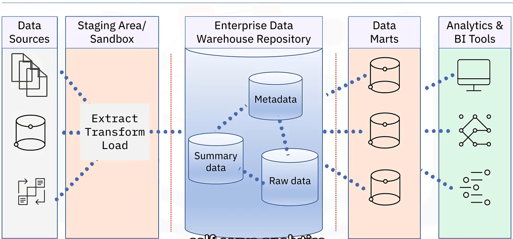

# Data Warehouse Architecture Overview

Goals of this section:

- List use cases that drive data warehouse design considerations.
- Describe a general data warehousing architecture and list it's component layers.
- Distinguish between general and reference enterprise data warehouse architecture.
- Describe reference architectures for two enterprise data warehouse platforms.

## Data warehouse architecture

The details of the architecture of a data warehouse depend on the intended usage of the platform. Requirements can include:

- Report generation and dashboarding.
- Exploratory data analysis.
- Automation and machine learning.
- Self-serve analytics.

Let's start by considering a general architectural model for an Enterprise Data Warehouse, or EDW platform, which companies can adapt for their analytics requirements. In this architecture, you can have various layers or components, including:

- Data sources: such as flat files, databases, and existing operational systems.
- An ETL layer: for extracting, transforming and loading data. An optional staging and sandbox areas for holding data and developing workflows.
- The EDW repository.
- Sometimes data marts, which are known as a "hub and spoke" architecture when multiple data marts are involved.
- Then an analytics layer powered by business intelligence tools.

Data warehouses also enforce security for incoming data and data passing through to further stages and users throughout the network.

## EDW reference architectures

Enterprise data warehouse vendors often create proprietary reference architecture and implement template data warehousing solutions that are variations on this general architectural model. A data warehousing platform is a complex environment with lots of moving parts, thus, interoperability among components is vital. Vendor-specific reference architecture typically incorportates tools and products from the vendors ecosystem that work well together.

## Summary

In this section, you learned that:

- A general architectural model includes data sources gathering, ETL pipelines, optional staging and sandbox areas, EDW repository, optional data marts and analytics/BI tools.
- Companies can adapt the general EDW architecture to suit their analytics requirements.
- Vendors offer reference EDW architectures that are tested to ensure interoperability.