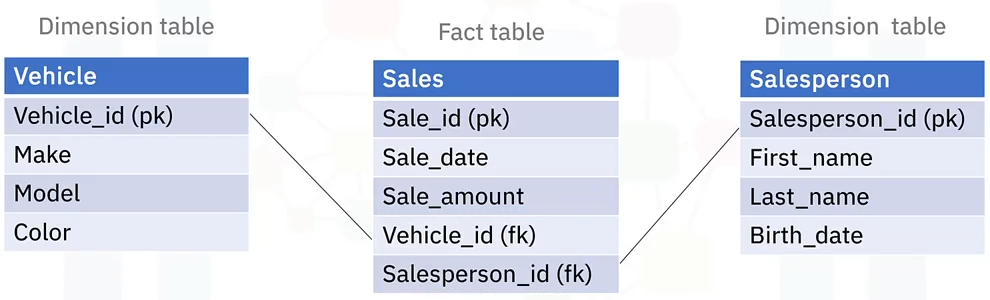

# Facts and Dimensional Modeling

Goals of this section:

- Define what facts are in context of data warehousing.
- Define what a fact table is.
- Define what dimensions are in context of data warehousing.
- Define what a dimension table is.
- Describe an example of a fact and its dimensions.

## Facts and Dimensions

Data can be lumped into two categories: **facts** and **dimensions**.

Facts are usually quantities which can be measured, such as temperature, number of sales, or mm of rainfall. But facts can also be qualitative in nature.

Dimensions are attributes which can be assigned to facts. They provide context to facts, which makes facts useful. For example, a temperature such as "_24°C_", all by itself, is not meaningful information.

Let's look at a familiar example. Here we have a weather report aquired by searching "weather in Freetown, Sierra Leone".

The facts here are things like the temperature, humidity, and wind speed. Notice these are all quantities. 

But there are other facts here, such as the icons, which indicates "Clean", and "Partly Cloudy". These non-numeric facts are examples of qualitative facts.

To make sense of these facts, we need to provide context. Context is provided by dimensions, which includes things like the location, "Freetown, Sierra Leone", and the day and time, "Monday at 7PM".

The statement `24°C in Freetown, Sierra Leone on Monday, April 15th at 7:00 p.m.` means something.

## Fact tables

A fact table typically consists of the facts of a business process, and it also contains foreign keys which establish well-defined links to dimension tables. Usually facts are additive measures or metrics, such as dollar amounts for individual sales transactions.

A fact table can contain detail level facts, such as individual sales transactions, or facts that have been aggregated, such as daily or weekly sales totals.

Fact tables that contain aggregated facts are called summary tables. For example, you could summarize sales transactions by summing overall sales for each quarter of the year, in such a case the foreign key migh be "store_id".

## Snapshot fact tables

Accumulating snapshot fact tables are used to record events that take place during a well-defined business process.

Suppose you have finished configuring a custom computer for yourself online, and you have just placed your order. Ther `order_date`, and the `order_amount` are recorded in a snapshot table by the manufacturer, and a unique `order_id` is also assigned. Once your order is verified, your payment is processed. The `amount_paid`, and the `date_paid` are then recorded. After payment verification, the computer specifications are sent to the manufacturing department. Once the computer is in production, the `build_start_date` is entered, and once the computer is built, the `build_end_date` is recorded. Finally, once your computer is ready to be sent, the `ship_date` is recorded.

All those mentioned fields are stored in a single row of the table, which is uniquely identified by the `order_id`.

## Dimensions

A dimension is a variable that categorizes facts, dimensions are called the _categorical variables_ by staticians and machine learning engineers.

Dimensions enable users to answer business questions.

The main uses for dimensions in analytics include filtering, grouping, and labeling operations.

Commonly used dimensions include names of companies, products, and places, and date or time stamps.

A dimension table thus stores the dimensions of a fact and is joined to the fact table via a foreign key.

Some examples of various types of dimension tables include: product tables (make, model, color, size), employee tables (name, title, department), temporal tables (date/time at granularity of recorded events), geography tables (country, state, city, postal code).

## Example schema with fact & dimension tables

A fact table for recording sales at a car dealership. This table would store facts about each car sale such as `sale_date`, and `sale_amount`, as well as a primary key `sale_id`.

For each sales transaction, we also need to record it's dimensions like the Vehicle sold, and the Salesperson who sold it.

The attributes of these dimensions, such as the vehicle `make`, `model`, `color`, and the `first_name`, and `last_name` are stored in separate tables.

However, we link those dimensions tables with the fact table by recording the `vehicle_id` and `salesperson_id` as foreign keys in the fact table.

This way we typically end up with multiple dimension tables for each fact table.

## Summary

In this section, you learned that:

- Business data falls into two categories: facts and dimensions.
- Facts measure business processes (total amount of sales).
- Dimensions categorize facts (who, where and when the product was sold).
- Dimensions are categorical variables that provide context for facts and are used for filtering, grouping, and labeling.
- Facts and dimension tables are linked together by foreign and primary keys. 