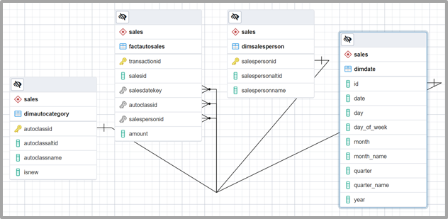

# Grouping Sets in SQL

The _GROUPING SETS_ clause is used in conjunction with the _GROUP BY_ clause to allow you to easily summarize data by aggregating a fact over as many dimensions as you like.

## Recall SQL GROUP BY clause

Recall that the _GROUP BY_ clause allows you to summarize an aggregation such as _SUM_ or _AVG_ over the distinct members, or groups, of a categorical variable or dimension.

You can extend the functionality of the _GROUP BY_ clause using SQL clauses such as _CUBE_ and _ROLLUP_ to select multiple dimensions and create multidimensional summaries. These two clauses also generate grand totals, like a report you might see in a spreadsheet application or an accounting style sheet. Just like _CUBE_ and _ROLLUP_, the SQL _GROUPING SETS_ clause allows you to aggregate data over multiple dimensions but does not generate grand totals.

Let's explore more about the _GROUPING SETS_ clause working on a fictional dataset based on the following entity-relationship diagram



We need to [create tables](./src/grouping_sets_creates_script.sql), [insert a few data](./src/grouping_sets_inserts_script.sql), and [create a materialized view](./src/grouping_sets_materialized_view.sql) which will contains the columns: `date`, `autoclassname`, `isnew`, `salespersonname`, and `amount`.

The expected result is shown below.

```sql
SELECT * FROM DNsales;

    date    | autoclassname | isnew | salespersonname |  amount  
------------+---------------+-------+-----------------+----------
 2021-01-01 | SUV           | t     | John Smith      | 37800.00
 2021-01-02 | Sedan         | t     | John Smith      | 11500.00
 2021-01-03 | Hatchback     | f     | John Smith      | 24500.00
 2021-01-04 | Van           | f     | Bob Johnson     | 67800.00
 2021-01-05 | Truck         | t     | Bob Johnson     | 41500.00
 2021-01-06 | Sedan         | t     | Jane Doe        | 30000.00
 2021-01-07 | Van           | f     | John Smith      | 19500.00
 2021-01-08 | Hatchback     | f     | Bob Johnson     | 27450.00
 2021-01-09 | SUV           | t     | John Smith      | 11890.00
 2021-01-10 | Truck         | t     | Jane Doe        | 12600.00
 2021-01-11 | Van           | f     | John Smith      | 47500.00
 2021-01-12 | Hatchback     | f     | Bob Johnson     | 17000.00
 2021-01-13 | Sedan         | t     | Bob Johnson     | 19800.00
 2021-01-14 | Truck         | t     | Jane Doe        | 16500.00
 2021-01-15 | Van           | f     | John Smith      | 20400.00
(15 rows)
```

Let's say we want the total sales amount for each sales person. Then we would just create a query as follows:

```sql
SELECT
    salespersonname,
    SUM(amount)
FROM
    DNsales
GROUP BY
    salespersonname;

 salespersonname |    sum    
-----------------+-----------
 Jane Doe        |  59100.00
 John Smith      | 173090.00
 Bob Johnson     | 173550.00
(3 rows)
```

And it turned out very well, but what if we wanted to know the total amount of sales of new and old cars for each sales person?

```sql
SELECT
    salespersonname,
    isnew,
    SUM(amount)
FROM
    DNsales
GROUP BY
    salespersonname, 
    isnew;

 salespersonname | isnew |    sum    
-----------------+-------+-----------
 John Smith      | f     | 111900.00
 Bob Johnson     | f     | 112250.00
 John Smith      | t     |  61190.00
 Jane Doe        | t     |  59100.00
 Bob Johnson     | t     |  61300.00
(5 rows)
```

Fairly easy, huh? But if we pay attention to the result, because we added a new grouping set to our query (the `isnew` column), we now duplicate the sales person name in some rows, and also if we wanted to know the total sales amount in the `DNsales` materialized view, a new query is still required.

So here we will demonstrate the result we want to achieve in two ways, an ugly (because it's difficult to read and has less performance) and a pretty one (because it's more readable and performative).

```sql
 salespersonname | isnew |    sum    
-----------------+-------+-----------
 Bob Johnson     | t     |  61300.00
 Bob Johnson     |       | 173550.00
 Bob Johnson     | f     | 112250.00
 Jane Doe        | t     |  59100.00
 Jane Doe        |       |  59100.00
 John Smith      | t     |  61190.00
 John Smith      | f     | 111900.00
 John Smith      |       | 173090.00
                 |       | 405740.00
                 | t     | 181590.00
                 | f     | 224150.00
(11 rows)
```

The above output says the following:

1. Bob Johnson has sold a total of $173,550.00, from that $61,300.00 came from new automobiles, and $112,250 came from old ones.

2. Jane Doe has sold a total amount of $59,100.00 for new automobiles only.

3. John Smith has sold a total of $173,090.00, from that $61,190.00 came from new automobiles, and $111,900 came from old ones.

4. The total amount of sales if of $405,740.00, from that $181,590.00 came from new automobiles, and $224,150.00 came from old ones.

But how can we achieve this output using SQL?

### The ugly way

```sql
SELECT
    salespersonname,
    isnew,
    SUM(amount)
FROM
    DNsales
GROUP BY
    salespersonname, 
    isnew
UNION
SELECT
    salespersonname,
    NULL,
    SUM(amount)
FROM
    DNsales
GROUP BY
    salespersonname
UNION
SELECT
    NULL,
    isnew,
    SUM(amount)
FROM
    DNsales
GROUP BY
    isnew
UNION
SELECT
    NULL,
    NULL,
    SUM(amount)
FROM
    DNsales;
ORDER BY
    1;
```

### The pretty way

```sql
SELECT
    salespersonname,
    isnew,
    SUM(amount)
FROM
    DNsales
GROUP BY
  GROUPING SETS (
    (salespersonname, isnew),
    (salespersonname),
    (isnew),
    ()
  )
ORDER BY
  1;
```

## Summary

Essentially, applying _GROUPING SETS_ to the two dimensions, `salespersonname` and `isnew`, provides the same result that you would get by appending the two individual results of applying _GROUP BY_ to each dimension separately.