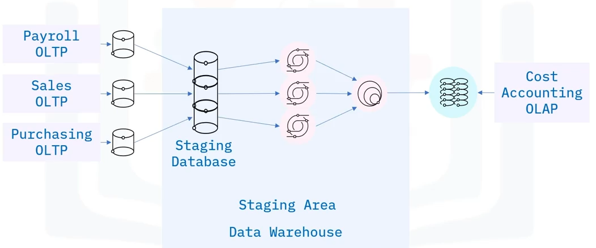

# Staging Areas for Data Warehouses

Goals of this section:

- Describe what a data warehouse staging area is.
- Describe why a staging area may be used.
- Relate how a staging area is used as a first step for integrating data sources.

## Staging area

What is a data warehouse staging area? You can think of a staging area as an intermediate storage area that is used for ETL processing. Thus, staging area acts as a bridge between data sources and the target data warehouses, data marts, or other data repos. Staging areas are often transient, meaning that they are erased after successfully running ETL workflows. However, many architectures retain this data for archival or troubleshooting purposes. They are also useful for monitoring and optimizing your ETL workflows.

## Staging areas implementation

Staging areas can be implemented in many ways, including:

- Simple flat files, such as `csv` files, stored in some directory, and managed using tools such as `Bash` or `Python`.
- A set of __SQL__ tables in a relational database such as PostgreSQL or Oracle.
- A self-contained database instance within a data warehousing or business intelligence platform such as Amazon QuickSight or Amazon Redshift.

## Staging area Use Case

Let us explore an example use case, to illustrate a possible architecture for a data warehouse containing a staging area, which in turn includes an associated staging database.

Imagine the enterprise would like to create a dedicated "Cost Accounting" Online Analytical Processing System. The required data is managed in separate Online Transaction Processing systems within the enterprise, from the Payroll, Sales, and Purchase departments. From these siloed systems, the data is extracted to individual _Staging Tables_, which are created in the Staging Database. Data from these tables is them transformed in the Staging Area using __SQL__ to conform it to the requirements of the Cost Accounting system. The conformed tables can now be integrated, or joined, into a single table. The final phase is the loading phase, where the data is loaded into the target cost-accounting system.

## Functions of a staging area

A staging area can have many functions, some typical ones include:

- __Integration__: Indeed, one of the primary functions performed by a staging area is consolidation of data from multiple source systems.
- __Change detection__: Staging areas can be setup to manage extraction of new and modified data as needed.
- __Scheduling__: Individual tasks within an ETL Workflow can be scheduled to run in a specific sequence, concurrently, and at certain times.
- __Data cleansing and validation__: You can handle missing values and duplicated records.
- __Aggregating data__: You can use the staging area to summarize data. For example, daily sales can be aggregated in weekly, monthly, or annual averages, prior to loading into a reporting system.
- __Normalizing data__: To enforce consistency of data types, or names of categories such as country and state codes in place of mixed naming conventions such as "Mont", "MA", or "Montana".

## Why using a staging area?

- A staging area is a separate location, where data from source systems is extracted to.
- The extraction step therefore decouples operations such as validation, cleansing, and other processes from the source environment.
- Helps to minimize any risk of corrupting source-data systems.
- Simplifies ETL workflow construction, operation, and maintenance.
- If any of the extracted data becomes corrupted somehow, you can easily recover.

## Summary

In this section, you learned that:

- A staging area acts as a bridge between data sources and the target system and are mainly used to integrate disparate data sources in data warehouses.
- Can be implemented quite simply as a set of flat files in a directory and managed with scripts, or as tables in a database.
- Decouple data processing from the source systems, and thus help minimize risk of data corruption.
- Although they are often transient, staging areas can be held for archiving or troubleshooting purposes.
