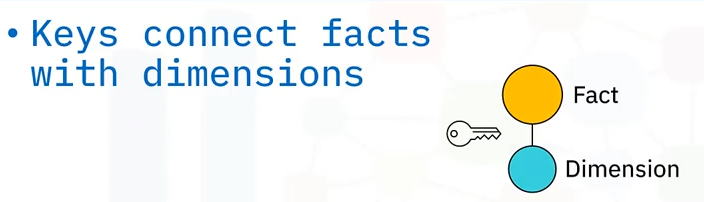
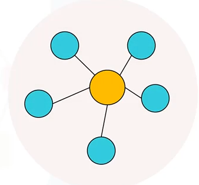
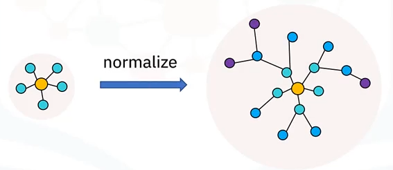
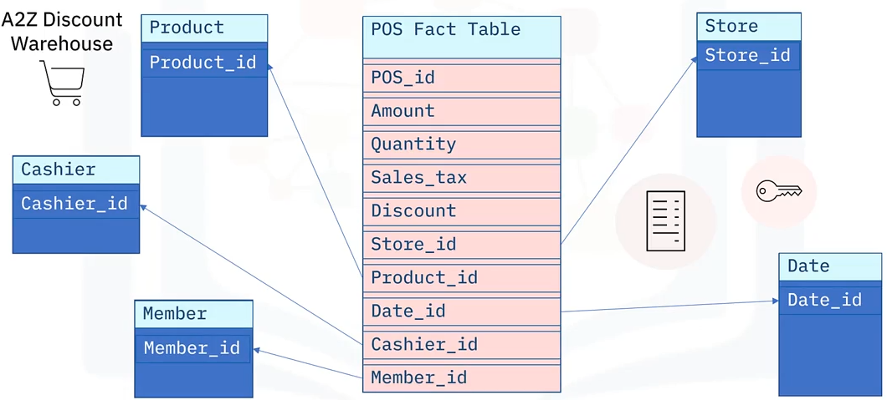
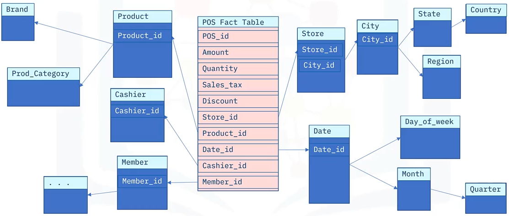

# Data Modeling using Star and Snowflake schemas

Goals of this section:

- Describe star schema modeling in terms of facts and dimensions.
- Describe snowflake schema as an extension of star schema.
- Distinguish between star and snowflake schema in terms of normalization.

## Star schemas

Recall that a fact table contains foreign keys that refer to the primary keys of dimension tables.

The idea of a star schema is based on the way a set of dimension tables can be visualized, or modeled, as radiating from a central fact table, linked by these keys.

A star schema is thus a graph, whose nodes are fact and dimension tables, and whose edges are the foreign keys between them.

Star schemas are commonly used to develop specialized data warehouses called _data marts_.

## Snowflake schemas

Snowflake schemas are a generalization of star schemas, and can be seen as normalized star schemas.

Normalization means separating the levels or hierarchies of a dimension table into separate child tables.

A schema don't need to be fully normalized to be considered a snowflake, so long as at least one of its dimensions has its levels separated.

## Modeling with Star schema

Now we will see some general principles you need to consider when designing a data model for a star schema.

1. Select a business process as the basis for what you want to model (sales, supply chain logistics, etc.).
2. Choose the granularity, which is the level of detail that you need to capture. Are you interested in coarse-grained or fine-grained data? Do you want annual regional sales numbers or, maybe you want to drill down into monthly sales performance by salesperson?
3. Identify the dimensions. Try to gather as much information as possible about the business process. For example, if you want to model sales by product, you may want to identify the product make, model, color, and size.
4. Identify the facts, these are the measures you want to capture in the business process. For example, if you want to model sales by product, you may want to identify the sales amount and date.

### Data Warehouse Architecture

Let's apply the previous considerations to a scenario that you are a data engineer helping to lay out the data ops for a new store called "A2Z Discount Warehouse".

They would like you to develop a data plan to capture every day POS (point of sale) transactions that happen at the till, where customers have their items scanned and pay for them. Thus, point of sale transactions is the business process that you want to model.

The finest granularity you can expect to capture from POS transactions comes from the individual line items, which is included in the detailed information you can see on a typical store receipt. This is precisely what "A2Z Discount Warehouse" is interested in capturing.

They next step in this process is to identify the dimensions. These include the attributes such as: the date and time of the transaction, the location, the product being sold, store name, and the cashier who processed the transaction. You might add other dimensions, like payment method, whether the line item is a return or a purchase, and perhaps the customer membership number.

Now it's time to consider the facts. Thus, you identify facts such as the amount for each item price, the quantity of each item sold, any discounts applied to the sale, and the sale taxes applied. Other facts to consider include environmental fees, shipping costs, and other fees like deposit fees for returns.

### Point of sale star schema

Now we're ready to start building your star schema for "A2Z Discount Warehouse" ⭐.

At the center of your star schema sits a "point of sale" fact table, which contains:

- A unique id *pos_id*, for each line item in the transaction.
- The *amount* of the transaction.
- The *quantity* of items involved in the transaction.
- The *sales_tax* of the transaction.
- The *discount* of the transaction.

There may be other facts to include, but these can be added later as you discover them.

Each line item from a sales transaction has many dimensions associated with it. You include them as foreign keys in your fact table, or as links to the primary keys of your dimension tables.

For example, the name of the store at which the item was sold is kept in a dimension table called "store", which is identified in the fact table by the value of the foreign *store_id* key, which is the primary key of the Store table. Product information is stored in the Product table, which is uniquely identified by *product_id* key. Similarly, the name of the cashier who processed the transaction is stored in the Cashier table, which is uniquely identified by the *cashier_id* key. And the date of the transaction is keyed by the *date_id* key. And the membership number of the customer is stored in the Member table, which is uniquely identified by the *member_id* key.

This illustrates what a star schema looks like so far:

### From star to snowflake

Let's see how you can use normalization to extend your star schema to a snowflake schema ❄️.

Starting with your star schema, you can extract some details of the dimensions tables into their own separate dimensions tables, creating a hierarchy of tables.

A separate city table can be used to record which city the store is in, while a foreign key *city_id* would be included in the Store table to maintain the link. You might also have tables and keys for the city's state or province, and a pre-defined sales region for the store, and for which country the store resides in.

We left out the associated keys for simplicity, so we can continue to normalize other dimensions, like the product's brand, and a product category that it belongs to. The day of week, and the month corresponding to the date, plus the quarter, and so on.

This normalized version of the star schema is called a snowflake schema, due to its multiple layers of branching which resembles a snowflake pattern.

Much like pointers are used to point to memory locations in computing, normalization reduces the memory footprint of the data.

## Summary

In this section, you learned that:

- Facts and dimension tables, linked by keys, form star and snowflake modeling schemas.
- Design considerations include identifying a business process, its granularity, and its facts and dimensions.
- Snowflake schemas are normalized star schemas.
- Normalization involves separating dimension tables into individual tables defined by levels or hierarchy of the parent dimension, and reduces storage footprint.