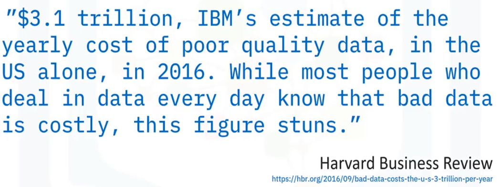

# Verifying Data Quality

Goals of this section:

- Describe data quality verification.
- Identify why organizations verify data quality.
- List examples of data quality concerns.
- Outline a process for managing data quality.

## What is data quality verification?

Data verification includes checking your data for:

- __Accuracy__: is your data correct?
- __Completeness__: is there missing data?
- __Consistency__: are fields consistently entered?
- __Currency__: is your data up to date?

## Why use data quality verification?

Data verification is about managing data quality and enhancing its reliability. High-quality data enables successful integration of related data and integrity of complex relationships. Data verification also provides you:

- A complete, connected view of your organization;
- Data that is ready for advanced analysis;
- Statistical modeling and machine learning;
- More confidence in your insights and decision-making.

Unfortunately, data quality is not a top concern among the daily chaos of running a company.

## Data quality concerns

Let's identify data quality concerns that organizations contend with:

### Accuracy

Accuracy includes ensuring a match between source data and destination data. How can accuracy become an issue? Data migrating from source systems often contains duplicated records; When users enter data manually, typos can find their way into the data records, yielding out-of-range values, outliers, and spelling mistakes; Sometimes large chunks of data become misaligned, causing data corruption, for example, a __CSV__ file might contain a legitimate comma, which the new system can misinterpret as a column separator.

### Completeness

Data is incomplete when the business finds missing values, such as voids or nulls in fields that should be populated, or haphazard use of placeholders such as `999` or `-1` to indicate a missing value; Entire records can also be missing due to upstream system failures.

### Consistency

Are there deviations from standard terminology (e.g. Percent vs. Percentage)? Are dates entered consistently (e.g. 01/10/2020 vs. 10-01-2020)? Is data entered consistently (e.g. 1,000 vs. 1000)? Are the units consistent (e.g. miles vs. kilometers)?

### Currency

Is an ongoing data quality concern for most businesses. Currency is about ensuring your data remains up to date thus avoiding outdated information. For example, you might have a dimension table that contain customer addresses, some of which might be outdated, so you could check these against a change-of-address database and update your table as required. Customers can change their names for various reasons.

## Managing data quality

Determining how to resolve and prevent bad data can be a complex and iterative process. First, you'll implement rules to detect bad data. Then you'll apply those rules to capture and quarantine any bad data. You might need to report any bad data and share the finds with the appropriate domain experts. You and your team can investigate the root cause of each problem, searching for clues upstream in the data lineage. Once you diagnose each problem, you can begin correcting the issues.

Ultimately, you want to automate the entire data cleaning workflow as much as possible. For example, you need to validate the quality of data in the staging area before loading the data into a data warehouse for analytics. You determine that data from certain sources consistently has quality issues including:

- Missing data (null values)
- Duplicate values
- Out-of-range values
- Invalid values

### The action plan

Here's how an organization might manage and resolve these issues:

1. Write SQL queries to detect and test for these conditions.
2. Create rules for correcting and managing them (such as removing invalid rows).
3. Create a script that runs the data validation SQL queries every nightly loads to the data warehouse (applying corrective measures and transformations for some known issues).
4. Automate the script created in step 3.
5. Review the automated report generated by the script of step 4 and address issues that could not be resolved automatically.

## Data quality solutions

Some leading vendors and their tools for data quality solutions include:

- IBM
- SAP
- SAS
- Microsoft
- Oracle
- Talend (https://www.talend.com/)
- Informatica (https://www.informatica.com/)
- Precisely (https://precisely.com/)
- OpenRefine (https://openrefine.org/) __open source__

## Summary

In this section, you learned that:

- Data verification includes checking your data for accuracy, completeness, consistency, and currency.
- It is about managing data quality, enhancing its reliability, and maximizing data value.
- Determining how to resolve and prevent bad data can be a complex and iterative process.
